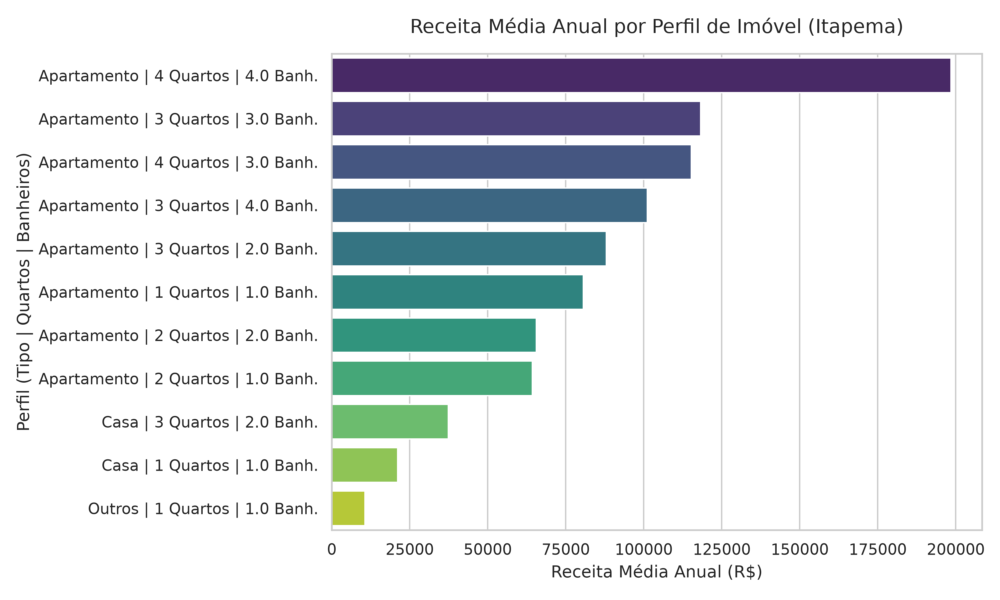
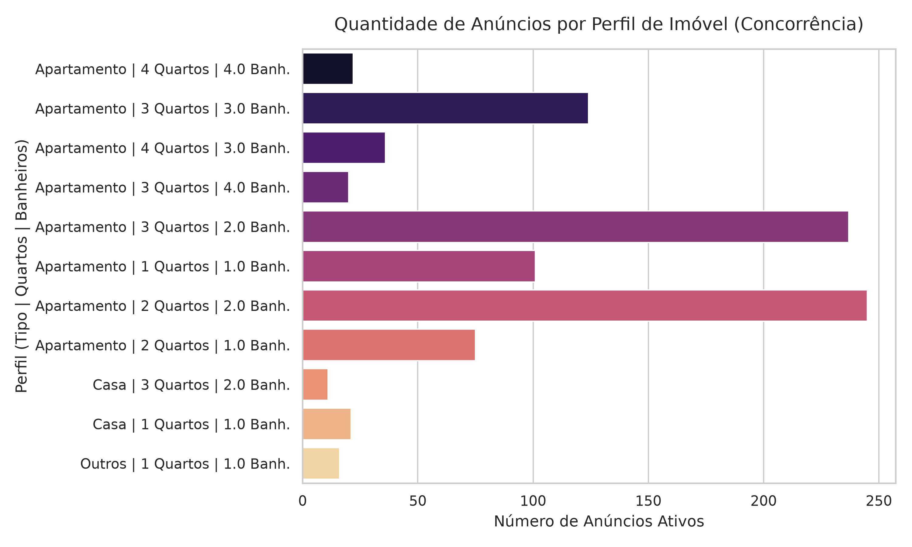

# Relatório de Faturamento por Perfil de Imóvel (Itapema)

Analisamos o mercado de locação de curta temporada (Airbnb) em Itapema para identificar quais perfis de imóveis geram a maior receita média anual. Filtramos a análise para exibir apenas configurações com uma amostra representativa (mais de 10 anúncios na cidade).

### Tabela de Desempenho (Ordenada por Receita Média Anual)

| Tipo de Imóvel | Quartos | Banheiros | Faturamento Total (R$) | Receita Média Anual (R$) | Qtd. de Anúncios (Amostra) |
|---|:---:|:---:|---:|---:|:---:|
| Apartamento | 4 | 4.0 | 4.366.371 | **198.471** | 22 |
| Apartamento | 3 | 3.0 | 14.663.160 | **118.251** | 124 |
| Apartamento | 4 | 3.0 | 4.148.599 | **115.238** | 36 |
| Apartamento | 3 | 4.0 | 2.022.922 | **101.146** | 20 |
| Apartamento | 3 | 2.0 | 20.864.790 | **88.037** | 237 |
| Apartamento | 1 | 1.0 | 8.145.716 | **80.650** | 101 |
| Apartamento | 2 | 2.0 | 16.073.470 | **65.605** | 245 |
| Apartamento | 2 | 1.0 | 4.819.998 | **64.266** | 75 |
| Casa | 3 | 2.0 | 410.618 | **37.328** | 11 |
| Casa | 1 | 1.0 | 444.634 | **21.173** | 21 |
| Outros | 1 | 1.0 | 170.478 | **10.654** | 16 |

---

## Gráficos de Análise

Utilize o carrossel abaixo para visualizar as diferenças de receita e concorrência (tamanho da amostra) entre os perfis:

````carousel

<!-- slide -->

````

> [!TIP]
> **Insights:**
> 1. Apartamentos de **alto padrão (4 quartos, 4 banheiros)** lideram o faturamento com folga (~R$ 198 mil/ano), mas representam um nicho exclusivo (apenas 22 imóveis).
> 2. O perfil mais equilibrado e maduro para investimento parece ser o **Apartamento de 3 quartos e 3 banheiros**, que gera uma receita anual excelente (~R$ 118 mil) e possui um volume de mercado consolidado (124 anúncios).
> 3. Os **Apartamentos de 2 e 3 quartos com 2 banheiros** concentram a maior concorrência da cidade, somando quase 500 anúncios, porém entregam receitas mais modestas na faixa de R$ 65k a R$ 88k.
